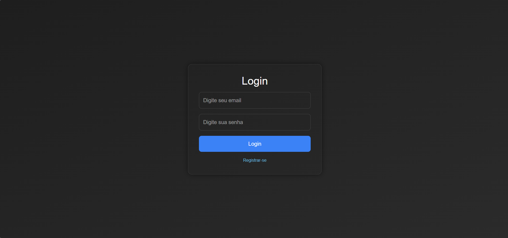
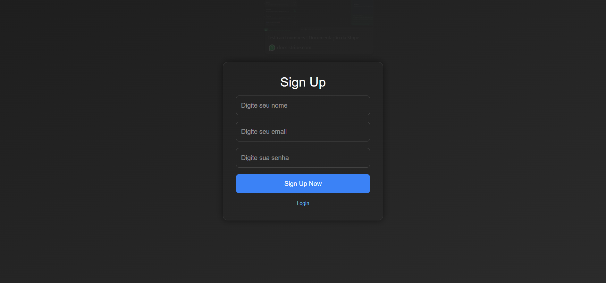
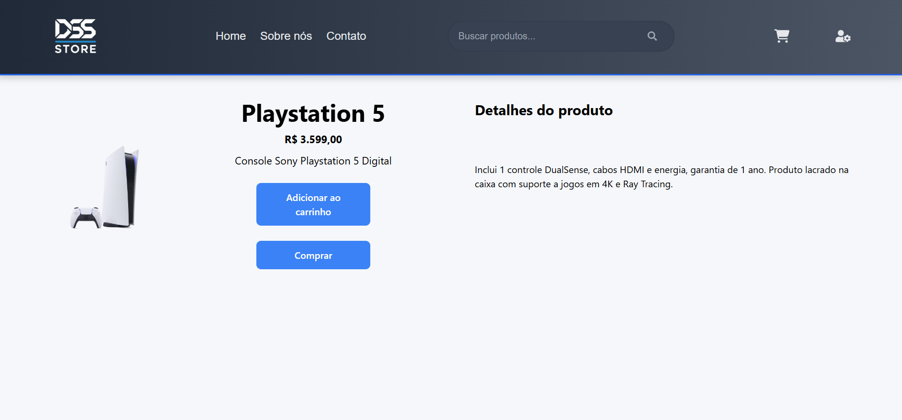
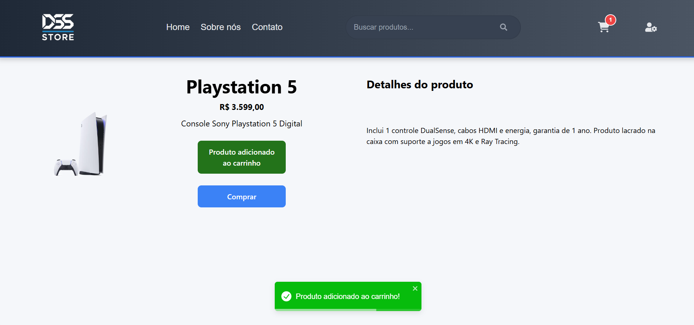
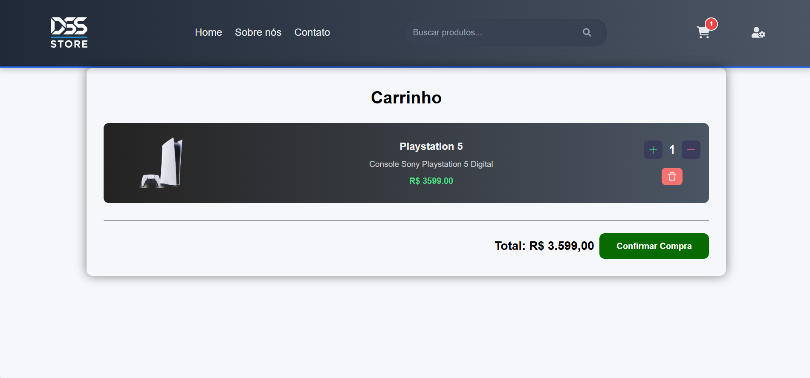
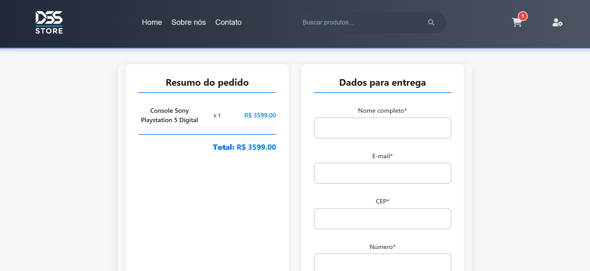
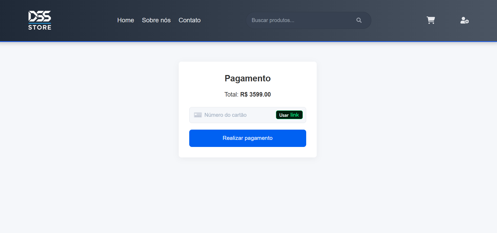
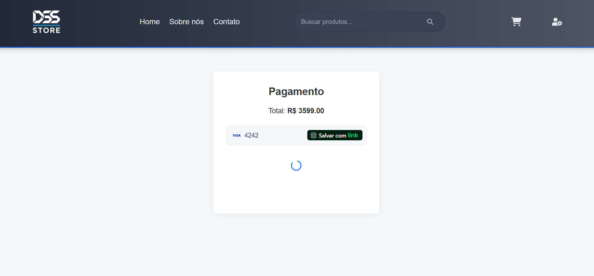
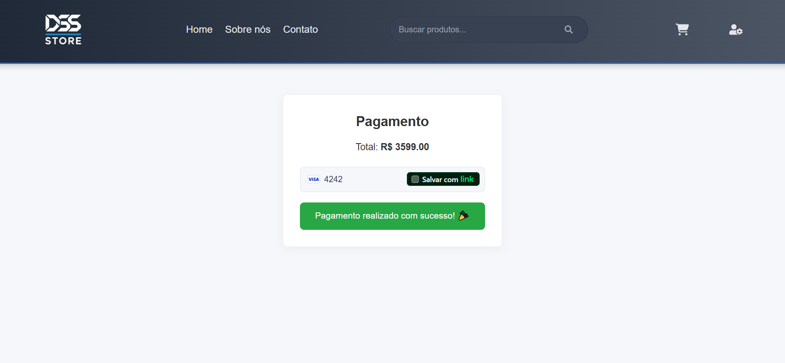

# 🛒 Marketplace - DSS Store

> Este projeto focou na criação do **Frontend**, utilizando o **Backend** para receber o 'pagamento' via **Stripe** :  
> - Cadastro de usuários  
> - Listagem e adição de produtos ao carrinho
> - Gerenciamento de estado com **Zustand**
> - Checkout com dados de contato e endereço de entrega  
> - Pagamento com cartão de crédito via **Stripe**  

---

## 🚀 Tecnologias

- **Backend**: Node.js, Express.js, Stripe API, cors, dotenv  
- **Frontend**: React, Vite, TypeScript, Zustand, Stripe.js, React Stripe  
- **Outras**: Git, npm  

---

## 📸 Capturas de Tela

### 1️⃣ Tela de Login


### 2️⃣ Tela de Cadastro


### 3️⃣ Tela Inicial


### 4️⃣ Detalhes do Produto



### 5️⃣ Carrinho de Compras


### 6️⃣ Comprar Produto


### 7️⃣ Pagamento





## 📦 Como rodar o projeto

Clone o repositório:
```bash
git clone https://github.com/delberss/marketplace.git
```

### Configuração Frontend

1. Acesse a pasta do frontend:
```bash
cd frontend
```
2. Instale as dependências do Frontend
```bash
npm install
```
3. Crie a pasta .env
4. Adicione a váriavel VITE_STRIPE_PUBLISHABLE_KEY
5. Entre em https://dashboard.stripe.com/test/apikeys e pegue a Chave secreta
6. Atribua essa chave a váriavel criada.  
Ex: VITE_STRIPE_PUBLISHABLE_KEY = XXXXXXXX


### Para rodar o Frontend
```bash
npm run dev
```

### Configuração Backend

1. Acesse a pasta do backend:
```bash
cd backend
```
2. Instale as dependências do backend:
```bash
npm install
```
3. Crie a pasta .env
4. Adicione a váriavel STRIPE_SECRET_KEY
5. Entre em https://dashboard.stripe.com/test/apikeys e pegue a Chave publicável
6. Atribua essa chave a váriavel criada.  
Ex: STRIPE_SECRET_KEY = XXXXXXXX


### Para rodar o Backend
```bash
npm run start
```
